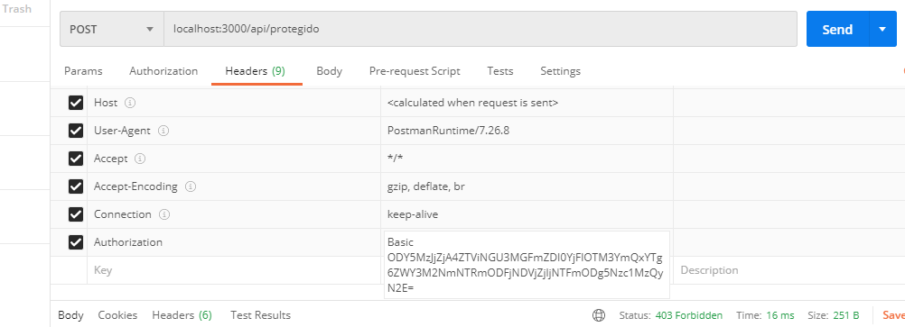

# Ejemplo de ApiKey

Ejemplo sencillo de apikey

## Requisitos:

Tener mongo. 

## Pasos:

desde la carpeta `ejemplo_apikey`:

- `cd server_node`
- `npm install`
- `cd ..`
- `node server_node/crear-apikey "Camara 1"`

El comando anterior genera una **apikey**, puedes corroborarlo en la base de datos `ejemplo_apikey`

- `node server_node/webapi`

(Debe tener el puerto `3000` desocupado)

Ahora, suponga que el cliente debe hacerle una petición a la ruta `api/protegido` (mediante apikey),
Debe enviar la cabecera de la siguiente forma:

`Authorization Basic base64encode(clientId + ":" + clientSecret)`

Debiese enviar lo mismo que se imprime en `crear-apikey.js` Ejemplo en Postman:

